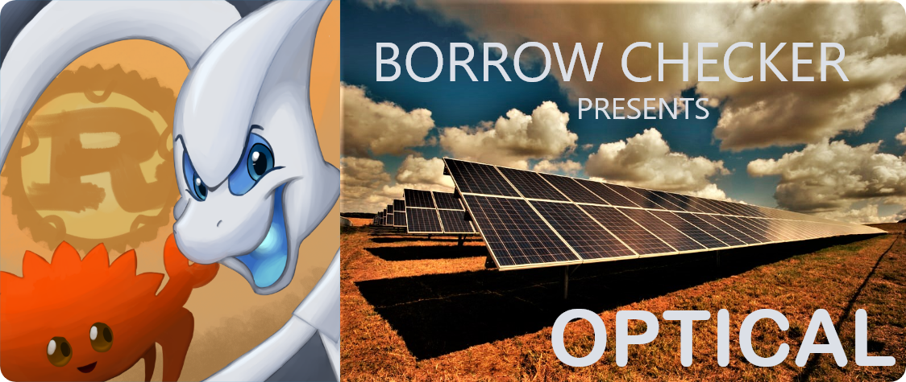

<p align="center"></p>

# 🌞 Optical


When energy is coming from the sun then why are we digging the Earth! *Optical* is the new preferred solar panel calculator that will help you to find the right solar panel for your house easily and help maximise your savings!

So what are you wating for? [Start saving!](https://optical-twt.herokuapp.com/)

# 🌠 Features
- Easy to use. Get started with a single click 👆
- Get all of the information you need in a single page 📃
    * Amount of sunlight on your roof top 🏠
    * Amount of solar panels you can fit on your roof 🔢
    * Amount of energy you can generate using the solar panels ⛈ 
- Easy to tweak your results by customising the amount of
    * Power you need 🔌

## ⚙️ Building Optical
1. Install the latest rust compiler.
2. Paste the following in your terminal:
    ```shell
    $ git clone https:/github.com/Andy-Python-Programmer/optical
    $ cd optical
    $ cargo run
    ```


## Team - Borrow Checker
- @Andy-Python-Programmer 🦀

Hello I am Anhad Singh. I am a 13 year old programmer. My main abilities are to code, create games, programming langauges and operating systems! Check out my [github profile](https://github.com/Andy-Python-Programmer) for more information.

*❝ Empowering everyone to rewrite everything in rust❞*

Created by team Borrow Checker for the 2021 (March - April) Timathon.

[](https://forthebadge.com)