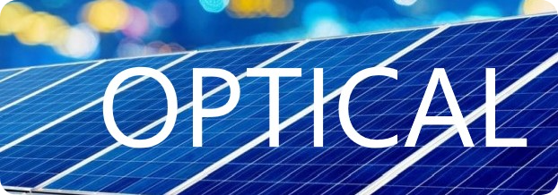

# Optical
[](https://twtcodejam.net/) 

Welcome to optical!

## ⚙️ Building Optical
1. Install the latest rust compiler.
2. Paste the following in your terminal:
    ```shell
    $ git clone https:/github.com/Andy-Python-Programmer/optical
    $ cd optical
    $ cargo run
    ```

## Team - Borrow Checker
- @Andy-Python-Programmer 🦀
- @bloatoo 🦀

*❝ Empowering everyone to rewrite everything in rust❞*